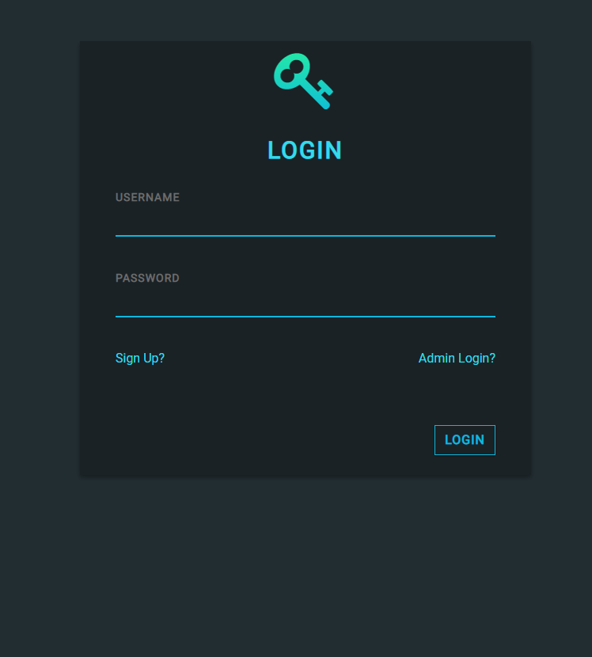
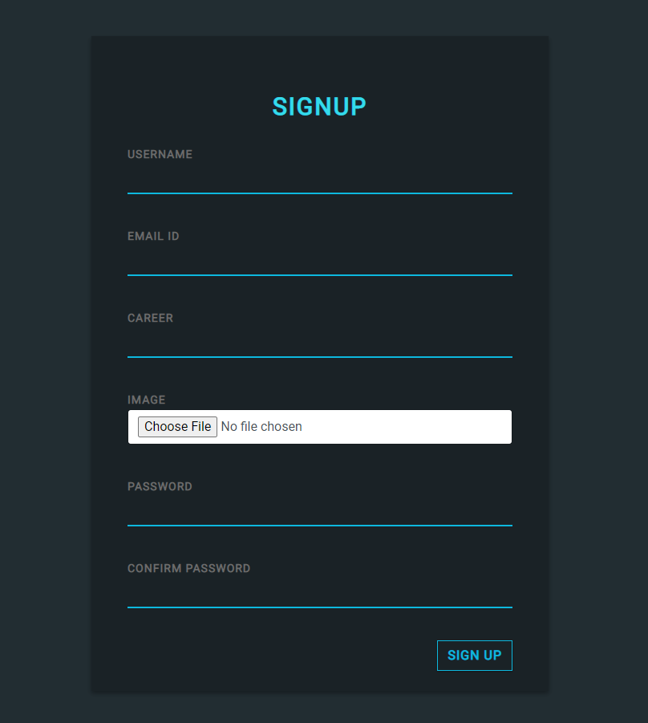
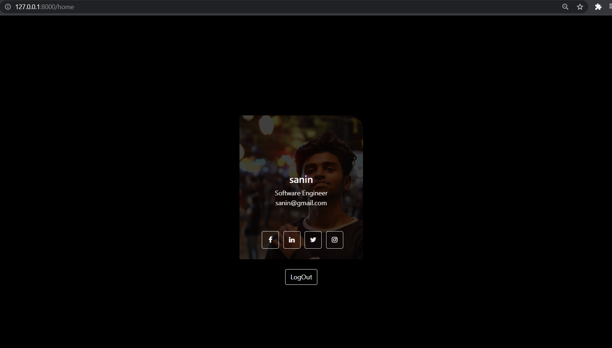
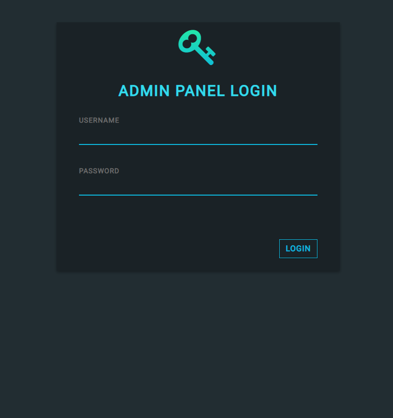
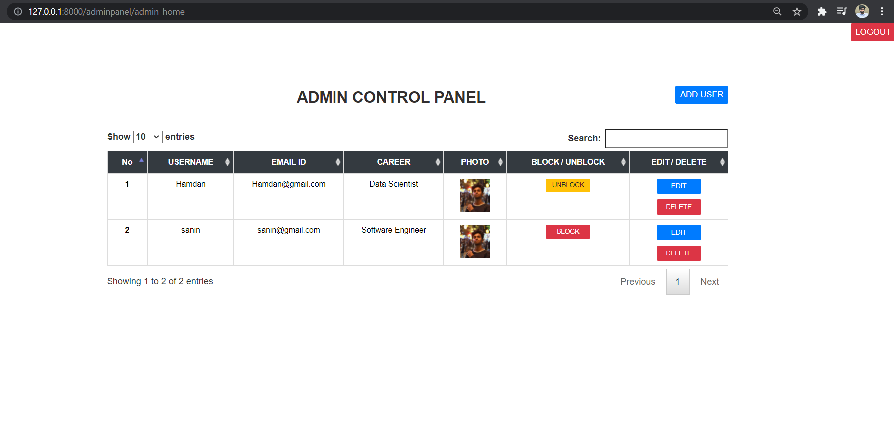

# user-management-system-python-django
This a simple user managment system where admin can control userdata and accesibility to the webpage. User can register , login , display their profile in home page. Admin can update delete block and add new user to the system.
<h2>screen recorded youtube video links are given below :</h2>
 
<a  href="https://youtu.be/DkZy7jw2ib4">User side</a>
 
<a  href="https://youtu.be/fW2pemu8AoA">Admin side</a>

<h1>Pages Included</h1>
<h3>1. User Login</h3>

<h3>2. User Registration</h3>

<h3>3. User Home Page</h3>

<h3>4. Admin login</h3>

<h3>5. Admin Home</h3>

